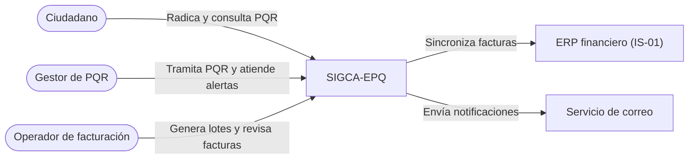
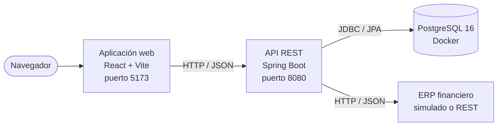

# SIGCA-EPQ

Prototipo del **Sistema de Información para la Gestión Comercial y Atención al Cliente** de
**Empresas Públicas del Quindío (EPQ)**, desarrollado en la asignatura **Ingeniería de Software 2** de la
Universidad del Quindío. Continúa el análisis del proyecto de Ingeniería de Software 1 (student book) e
implementa de punta a punta dos funcionalidades del Plan de Requisitos:

| Funcionalidad | Descripción | Requisitos |
|---|---|---|
| **F-01** Generar facturas mensuales | Facturación automática desde el primer día hábil del mes, liquidación por consumo medido y sincronización con el ERP financiero | RF-05, CU-03, SWR-01 a SWR-04, IS-01 |
| **F-02** Registrar y dar seguimiento a PQR | Radicación de peticiones, quejas y reclamos, asignación automática de gestor, control de plazos legales, alertas y trazabilidad | RF-08, RF-09, RF-10, CU-06, CU-07, RN-04, RN-06, DE-02, SWR-05 a SWR-09 |

---

## Contenido

1. [Estructura del repositorio](#1-estructura-del-repositorio)
2. [Stack tecnológico](#2-stack-tecnológico)
3. [Arquitectura](#3-arquitectura)
4. [Puesta en marcha](#4-puesta-en-marcha)
5. [Matriz de trazabilidad](#5-matriz-de-trazabilidad)
6. [Pruebas](#6-pruebas)
7. [Patrones de diseño](#7-patrones-de-diseño)
8. [Buenas prácticas](#8-buenas-prácticas)
9. [Alcance y decisiones del prototipo](#9-alcance-y-decisiones-del-prototipo)
10. [Solución de problemas](#10-solución-de-problemas)
11. [Flujo de trabajo con Git](#11-flujo-de-trabajo-con-git)
12. [Equipo](#12-equipo)

---

## 1. Estructura del repositorio

```
.
├── backend/                  API REST en Spring Boot → ver backend/README.md
│   ├── src/main/java/        Código fuente (módulos comun, pqr, facturacion)
│   └── src/test/java/        Pruebas unitarias y de capa web
├── frontend/                 Aplicación web en React → ver frontend/README.md
│   └── src/                  Portal ciudadano y back-office
├── database/
│   └── init/
│       ├── 01_schema.sql     Esquema completo: PQR + Facturación
│       └── 02_seed_data.sql  Datos de prueba
├── postman/
│   ├── SIGCA-EPQ.postman_collection.json      Colección de pruebas de la API
│   └── SIGCA-EPQ-local.postman_environment.json
├── docker-compose.yml        Contenedor de PostgreSQL
└── .env.example              Plantilla de variables de entorno
```

| Documento | Contenido |
|---|---|
| [`backend/README.md`](backend/README.md) | Endpoints, arquitectura del backend, patrones, SOLID, decisiones y limitaciones |
| [`frontend/README.md`](frontend/README.md) | Pantallas, arquitectura del frontend, sistema visual, accesibilidad y convenciones |

---

## 2. Stack tecnológico

| Capa | Tecnologías |
|---|---|
| Base de datos | PostgreSQL 16 en Docker |
| Backend | Java 21, Spring Boot 3.5 (Web, Data JPA, Validation, Actuator), springdoc-openapi |
| Frontend | Vite 8, React 19, React Router, TanStack Query, CSS propio con variables |
| Pruebas | JUnit 5, Mockito, Spring MockMvc, JaCoCo, Postman |
| Calidad | ESLint (frontend), Conventional Commits, Pull Requests con revisión |

---

## 3. Arquitectura

### 3.1 Contexto

Quién usa el sistema y con qué sistemas externos se comunica (student book, sección 2.1.3).



### 3.2 Contenedores



- **Aplicación web:** portal ciudadano público (radicar y consultar PQR) y back-office de funcionarios
  (PQR y facturación).
- **API REST:** organizada por funcionalidad en los módulos `pqr/` y `facturacion/`, con lo común en
  `comun/`. Incluye tareas programadas: monitoreo de plazos cada 15 minutos y facturación diaria a la 1:00 a. m.
- **ERP:** detrás de la interfaz `ErpFinancieroGateway`; se elige el adaptador simulado o el REST con
  `app.erp.modo`.

### 3.3 Organización del código

Ambos proyectos se organizan **por funcionalidad** (PQR y facturación), con capas dentro de cada módulo:

| Proyecto | Módulos | Capas dentro de cada módulo |
|---|---|---|
| Backend | `pqr/`, `facturacion/`, `comun/` | `dominio`, `repositorio`, `servicio`, `web`, `evento`, `tarea` |
| Frontend | `paginas/ciudadano/`, `paginas/gestion/pqr/`, `paginas/gestion/facturacion/` | Página, componentes propios y estilos; acceso a datos en `api/` y `hooks/` por módulo |

---

## 4. Puesta en marcha

### Requisitos

- **Docker Desktop**
- **JDK 21** (el backend incluye el wrapper `mvnw`; no hace falta instalar Maven)
- **Node.js 20.19 o superior** y npm (frontend y, opcionalmente, Newman)
- (Opcional) **Postman**, **DBeaver** o **pgAdmin**

### 4.1 Base de datos

Desde la raíz del repositorio:

```bash
cp .env.example .env
```

Edita `.env` y asigna un valor a todas las variables:

```
POSTGRES_DB=epq_db
POSTGRES_USER=postgres
POSTGRES_PASSWORD=tu_contraseña
POSTGRES_PORT=5440
```

> **Sobre el puerto:** si tienes PostgreSQL instalado en tu equipo, ya usa el `5432` (y a veces el `5433`).
> Usa un puerto libre para el contenedor. Puedes comprobarlo con `netstat -ano | findstr :5440` (Windows)
> o `lsof -i :5440` (Linux/macOS).

Levanta el contenedor:

```bash
docker compose up -d
docker ps
```

La primera vez, PostgreSQL ejecuta `01_schema.sql` (17 tablas) y `02_seed_data.sql` (datos de prueba), y tarda
unos segundos en aceptar conexiones. Para esperar a que esté lista y verificar los datos:

```bash
until docker exec epq_db pg_isready -U postgres -d epq_db > /dev/null 2>&1; do sleep 1; done
docker exec -it epq_db psql -U postgres -d epq_db -c "SELECT COUNT(*) FROM contrato;"
```

Debe devolver `9`.

> Los scripts de `database/init` solo se ejecutan cuando el volumen está vacío. Para recrear la base desde cero:
> `docker compose down -v && docker compose up -d`

**Módulos del esquema**

- **PQR:** `tipo_solicitud`, `canal_atencion`, `estado_pqr`, `ciudadano`, `gestor`, `pqr`, `historial_pqr`, `notificacion`
- **Facturación:** `cliente`, `servicio`, `tarifa`, `contrato`, `medidor`, `lectura_medidor`, `lote_facturacion`, `factura`, `sincronizacion_erp`

**Conexión con DBeaver o pgAdmin:** host `localhost`, y el puerto, la base de datos, el usuario y la contraseña de tu `.env`.

### 4.2 Backend

```bash
cd backend
./mvnw spring-boot:run        # Windows (CMD/PowerShell): mvnw.cmd spring-boot:run
```

El backend lee las credenciales del mismo `.env` de la raíz. Cuando arranque:

| Recurso | URL |
|---|---|
| API | `http://localhost:8080/api` |
| Documentación Swagger | `http://localhost:8080/swagger-ui.html` |
| Estado de salud | `http://localhost:8080/actuator/health` → `{"status":"UP"}` |

**Parámetros útiles para demostraciones** (sin editar `application.yml`):

```bash
# Desactivar el monitoreo automático para ejecutarlo solo con el botón de Alertas
./mvnw spring-boot:run -Dspring-boot.run.arguments=--app.pqr.monitoreo-cron=-

# Simular que el ERP rechaza el 50 % de los envíos
./mvnw spring-boot:run -Dspring-boot.run.arguments=--app.erp.simulado.tasa-fallo=0.5
```

### 4.3 Frontend

```bash
cd frontend
cp .env.example .env     # VITE_API_URL=http://localhost:8080/api
npm install
npm run dev
```

La aplicación queda en `http://localhost:5173`. Para el back-office, entra por **Acceso funcionarios** y
elige un gestor en **Gestor actual** (el prototipo no tiene login). La documentación completa está en
[`frontend/README.md`](frontend/README.md).

---

## 5. Matriz de trazabilidad

Relaciona cada requisito del Plan de Requisitos (SWR) y del student book (RF, CU, RN, DE) con su
implementación y con las pruebas que lo verifican. Los endpoints tienen el prefijo `/api`.

### F-01 · Generar facturas mensuales (RF-05, CU-03)

| Requisito | Backend | Endpoint | Pantalla | Pruebas unitarias | Postman |
|---|---|---|---|---|---|
| **SWR-01** Generación el primer día hábil del mes | `FacturacionMensualTarea`, `CalendarioLaboralColombia`, `ConsultaFacturacionServiceImpl` | `GET /facturacion/programacion`, `POST /facturacion/lotes` | Facturación | `FacturacionMensualTareaTest`, `CalendarioLaboralColombiaTest`, `ConsultaFacturacionServiceImplTest` | 04 · Programación y generación del lote |
| **SWR-02** Lote en máximo 60 minutos | `GeneracionFacturacionServiceImpl`, `LoteFacturacion` | `POST /facturacion/lotes`, `GET /facturacion/lotes` | Facturación, Lotes, Detalle del lote | `GeneracionFacturacionServiceImplTest`, `LoteFacturacionTest` | 04 · Generar lote (dentro del tiempo máximo) |
| **SWR-03** Cálculo por lectura, consumo y tarifa | `FacturadorContrato`, `CalculoPorConsumoMedido`, `SelectorEstrategiaCalculo`, `NumeroFacturaPorPeriodo` | `GET /facturacion/facturas/{numero}` | Facturas, Detalle de factura | `FacturadorContratoTest`, `CalculoPorConsumoMedidoTest`, `NumeroFacturaPorPeriodoTest` | 04 · Detalle de factura ($81.783,25) |
| **SWR-04** Sincronización con el ERP (IS-01) | `SincronizadorFacturaErp`, `ErpFinancieroGateway` (simulado y REST), `SincronizacionErpServiceImpl` | `POST /facturacion/facturas/{numero}/sincronizacion`, `POST /facturacion/lotes/{periodo}/sincronizacion`, `GET /facturacion/facturas/{numero}/sincronizaciones` | Facturas, Detalle del lote, Detalle de factura | `SincronizadorFacturaErpTest`, `SincronizacionErpServiceImplTest`, `ErpFinancieroSimuladoAdapterTest`, `ErpFinancieroRestAdapterTest` | 04 · Bitácora y reintento del lote; 05 · Factura ya sincronizada |
| Contratos no activos, sin lectura o sin tarifa no se facturan | `FacturadorContrato` | `POST /facturacion/lotes` | Resultado del lote en Facturación | `FacturadorContratoTest` | 04 · Incidencia de `CT-ACU-0005` |
| Generar de nuevo no duplica facturas (permite reintentar, SWR-01) | `FacturadorContrato`, `GeneracionFacturacionServiceImpl` | `POST /facturacion/lotes` | Facturación | `FacturadorContratoTest`, `GeneracionFacturacionServiceImplTest` | 04 · Generar lote otra vez |

### F-02 · Registrar y dar seguimiento a PQR (RF-08, RF-09, RF-10)

| Requisito | Backend | Endpoint | Pantalla | Pruebas unitarias | Postman |
|---|---|---|---|---|---|
| **RF-08 / CU-06** Registro de la PQR | `RegistroPqrServiceImpl`, `Pqr.radicar` | `POST /pqr` | Radicar PQR | `RegistroPqrServiceImplTest`, `PqrTest`, `PqrControllerTest` | 02 · Registrar PQR; 03 · Validaciones |
| **SWR-05** Radicado único `YYYYMM-NNNN` | `GeneradorRadicadoMensual` | `POST /pqr` | Constancia de radicación | `GeneradorRadicadoMensualTest`, `RegistroPqrServiceImplTest` | 02 · Registrar PQR (formato del radicado) |
| **SWR-06 / RN-04** Fecha límite en días hábiles (10 o 15) | `CalculadoraPlazoRespuesta`, `CalendarioLaboralColombia` | `POST /pqr` | Constancia, Consulta, Bandeja | `CalculadoraPlazoRespuestaTest`, `CalendarioLaboralColombiaTest` | 02 · Registrar PQR (fechas límite y estimada) |
| **RF-08** Asignación automática del gestor | `AsignacionPorMenorCarga` | `POST /pqr` | Bandeja, Detalle | `AsignacionPorMenorCargaTest`, `RegistroPqrServiceImplTest` | 02 · Detalle de la PQR (gestor asignado) |
| **RF-09 / CU-06 / DE-02** Tomar, reasignar, responder y cerrar | `GestionPqrServiceImpl`, `Pqr`, `EstadoPqrTipo` | `PATCH /pqr/{radicado}/tomar`, `/reasignar`, `/responder`, `/cerrar` | Bandeja, Detalle de PQR | `GestionPqrServiceImplTest`, `PqrTest`, `EstadoPqrTipoTest`, `PqrControllerTest` | 02 · Pasos 5 a 8; 03 · Transiciones inválidas (409) y reglas (422) |
| **RN-06** Respuesta formal obligatoria | `Pqr.registrarRespuesta`, `ResponderPqrRequest` | `PATCH /pqr/{radicado}/responder` | Diálogo Responder | `PqrTest`, `GestionPqrServiceImplTest`, `PqrControllerTest` | 03 · Respuesta muy corta |
| **SWR-07** Alerta 48 horas antes del vencimiento | `MonitoreoPlazosPqrServiceImpl`, `MonitoreoPlazosPqrTarea`, `ServicioNotificacionPqr` | `POST /pqr/monitoreo`, `GET /gestores/{id}/notificaciones` | Alertas, Bandeja (plazo en ámbar), Detalle | `MonitoreoPlazosPqrServiceImplTest`, `MonitoreoPlazosPqrTareaTest`, `ServicioNotificacionPqrTest` | 02 · Ejecutar monitoreo |
| **RN-04** Marcado de PQR vencidas | `MonitoreoPlazosPqrServiceImpl`, `Pqr.marcarVencida` | `POST /pqr/monitoreo` | Alertas, Bandeja (métrica de vencidas) | `MonitoreoPlazosPqrServiceImplTest`, `PqrTest` | 02 · Ejecutar monitoreo |
| **RF-10 / CU-07 / SWR-08** Consulta pública sin login | `ConsultaPqrServiceImpl` | `GET /pqr/consulta/{radicado}` | Consulta de estado | `ConsultaPqrServiceImplTest`, `PqrControllerTest` | 02 · Consulta pública; 03 · Radicado inexistente |
| **SWR-09** Auditoría de creación, asignación, trámite y respuesta | `AuditoriaPqrListener`, eventos de dominio | `GET /pqr/{radicado}/historial` | Detalle de PQR (historial) | `AuditoriaPqrListenerTest`, `GestionPqrServiceImplTest` | 02 · Historial de la PQR |
| Notificación al ciudadano y al gestor | `NotificacionPqrListener`, `ServicioNotificacionPqr` | `GET /pqr/{radicado}/notificaciones` | Detalle de PQR, Alertas | `NotificacionPqrListenerTest`, `ServicioNotificacionPqrTest` | 02 · Notificaciones de la PQR |

---

## 6. Pruebas

El sistema se valida en tres niveles complementarios:

| Nivel | Herramienta | Qué valida | Requiere BD |
|---|---|---|---|
| Unitarias y de capa web | JUnit 5, Mockito, MockMvc | Reglas de negocio, servicios, controladores, validaciones y manejo de errores, de forma aislada | No |
| Funcionales de la API | Postman | Flujos completos de extremo a extremo contra el backend real y PostgreSQL | Sí |
| Manuales de extremo a extremo | Frontend | Recorridos completos de F-01 y F-02 desde la interfaz | Sí |

### 6.1 Pruebas unitarias

```bash
cd backend
./mvnw clean test
```

Resultado esperado: **328 pruebas, 0 fallos**. No necesitan la base de datos ni el backend en ejecución.

| Tipo | Clases | Enfoque |
|---|---|---|
| Dominio | `Pqr`, `EstadoPqrTipo`, `LoteFacturacion` | Máquina de estados, transiciones válidas e inválidas, reglas RN-04 y RN-06, sin mocks |
| Servicios | `RegistroPqrServiceImpl`, `GestionPqrServiceImpl`, `MonitoreoPlazosPqrServiceImpl`, `FacturadorContrato`, `SincronizadorFacturaErp`, servicios de consulta | Casos de uso con repositorios simulados (Mockito) y un `Clock` fijo para fechas deterministas |
| Capa web | `PqrController`, `CatalogoPqrController`, `FacturacionController` | `@WebMvcTest`: rutas, códigos HTTP, validación de DTOs, JSON y errores RFC 7807 |
| Eventos y notificaciones | Listeners de auditoría y notificación, `ServicioNotificacionPqr` | Trazabilidad (SWR-09) y que un fallo de notificación no afecte la operación |
| Tareas programadas | `TareaProgramadaTemplate`, facturación mensual, monitoreo de plazos | Condiciones de ejecución (primer día hábil, lote completado) y aislamiento de errores |
| Integración con el ERP | Adaptador simulado y adaptador REST | El adaptador REST se prueba contra un servidor HTTP local real (200, 204, 4xx, 5xx y ERP caído) |
| Infraestructura | Conversores JPA, calendario laboral colombiano | Conversión de enums y periodos; festivos y días hábiles |

**Convenciones:** cada clase agrupa los casos por operación con `@Nested` y los describe con `@DisplayName` en
español; los datos se construyen con fábricas reutilizables (`DatosPruebaPqr`, `DatosPruebaFacturacion`) con
los mismos valores del seed; los casos de error verifican además que el estado no cambie y que no se ejecuten
efectos secundarios (guardar, publicar eventos, llamar al ERP).

### 6.2 Cobertura (JaCoCo)

`./mvnw test` genera el reporte en `backend/target/site/jacoco/index.html` (en Windows se abre con
`start target/site/jacoco/index.html` desde la carpeta `backend`).

| Métrica | Cobertura |
|---|---|
| Instrucciones | **94 %** |
| Ramas | **89 %** |

| Área | Instrucciones |
|---|---|
| Servicios, eventos, notificaciones, tareas, ERP, controladores y conversores | 94 – 100 % |
| Dominio PQR | 98 % |
| Dominio facturación | 83 % |
| Repositorios (`Specifications`) | 25 % |

Se excluyen del cálculo la clase principal, la configuración de Spring, las clases `*Properties` y los DTOs,
porque no tienen lógica. Los repositorios tienen baja cobertura unitaria a propósito: sus `Specifications`
construyen consultas JPA que solo tienen sentido contra PostgreSQL real, y se validan con Postman.

### 6.3 Pruebas de la API con Postman

Requiere la base de datos y el backend en ejecución (secciones 4.1 y 4.2).

1. En Postman, **Import** → selecciona los dos archivos de la carpeta `postman/`.
2. Arriba a la derecha, selecciona el entorno **SIGCA-EPQ Local**.
3. Clic derecho en la colección → **Run collection** → verifica que el entorno esté seleccionado en el Runner → **Run**.

Resultado esperado: **52 peticiones y 244 aserciones**, todas exitosas.

| Carpeta | Contenido |
|---|---|
| 00 - Salud | Health check |
| 01 - PQR Catálogos | Tipos, canales, estados y gestores activos |
| 02 - PQR Flujo completo | Radicado → En trámite → reasignación → Resuelto → Cerrado, historial, notificaciones y monitoreo |
| 03 - PQR Casos de error | Validaciones (400), recursos inexistentes (404), transiciones inválidas (409) y reglas de negocio (422) |
| 04 - Facturación | Programación, generación del lote, no duplicación, liquidación de `CT-ACU-0001` ($81.783,25) y sincronización con el ERP |
| 05 - Facturación Casos de error | Periodos inválidos, recursos inexistentes y facturas ya sincronizadas |

Las carpetas deben ejecutarse en orden, porque comparten variables. La colección **modifica los datos**
(radica PQR y genera el lote), así que conviene ejecutarla sobre una base recién creada.

**Por consola (opcional)** con [Newman](https://www.npmjs.com/package/newman):

```bash
npx newman run postman/SIGCA-EPQ.postman_collection.json \
    -e postman/SIGCA-EPQ-local.postman_environment.json
```

### 6.4 Recorrido de extremo a extremo

Con la base recién creada, el backend y el frontend en ejecución:

1. **F-02 · Portal:** radicar una PQR, revisar la constancia y consultar su estado.
2. **F-02 · Back-office:** tomarla, reasignarla, responderla y cerrarla; revisar el historial y consultarla de
   nuevo en el portal.
3. **F-02 · Alertas:** con el monitoreo automático desactivado (sección 4.2), ejecutar el monitoreo desde
   Alertas y verificar la alerta de 48 horas de la PQR `…-0002` del seed.
4. **F-01:** generar el lote del mes anterior (6 facturas, incidencia de `CT-ACU-0005`), generarlo de nuevo
   (0 generadas, 6 existentes) y revisar el lote y la factura de `CT-ACU-0001`.
5. **F-01 · ERP con fallos:** con la tasa de fallo en 0.5 (sección 4.2), generar el lote en una base nueva y
   reintentar la sincronización por factura y por lote.

---

## 7. Patrones de diseño

### Backend

| Patrón | Dónde | Para qué |
|---|---|---|
| **State** | `EstadoPqrTipo` | Cada estado define sus transiciones válidas (DE-02); `Pqr` rechaza cambios ilegales con 409 |
| **Strategy** | `PoliticaPlazoRespuesta` (`PlazoPeticion`, `PlazoQuejaReclamo`) | Plazo normativo por tipo de PQR (RN-04) |
| **Strategy** | `EstrategiaAsignacionGestor` (`AsignacionPorMenorCarga`) | Política de asignación automática del gestor |
| **Strategy** | `EstrategiaCalculoFactura` (`CalculoPorConsumoMedido`) + `SelectorEstrategiaCalculo` | Fórmula de liquidación (SWR-03); una fórmula por estrato se agrega sin tocar el proceso |
| **Observer** | `PqrRegistradaEvento`, `PqrAsignadaEvento`, `PqrEstadoCambiadoEvento` + listeners | Auditoría (SWR-09) y notificaciones desacopladas del caso de uso |
| **Adapter / Puerto** | `ErpFinancieroGateway` (simulado o REST), `CanalNotificacion` | Aislar sistemas externos; se cambian por configuración |
| **Facade** | `GeneracionFacturacionServiceImpl` | Un punto de entrada que coordina lote, liquidación y sincronización con el ERP |
| **Template Method** | `TareaProgramadaTemplate` | Esqueleto común de las tareas programadas (condición, medición, registro, aislamiento de errores) |
| **Specification** | `PqrSpecifications`, `FacturaSpecifications` | Filtros de búsqueda combinables |
| **Factory Method** | `Pqr.radicar`, `Factura.emitir`, `LoteFacturacion.abrir` | Crear entidades siempre en un estado válido |
| **Repository** | Repositorios de Spring Data JPA | Acceso a datos detrás de una interfaz |
| **DTO / Mapper** | `web/dto`, `PqrMapper`, `FacturacionMapper` | La API no expone entidades JPA ni datos personales innecesarios |

### Frontend

| Patrón | Dónde | Para qué |
|---|---|---|
| **Adapter** | `api/cliente.js` | Traduce las respuestas y los errores RFC 7807 del backend a `ErrorApi` |
| **Custom hooks** | `hooks/` | Encapsular la obtención de datos y la lógica reutilizable (filtros en la URL, título de página) |
| **Provider / Context** | `sesion/` | Gestor actual disponible en toda la aplicación, preparado para el login |
| **Composición de componentes** | `paginas/` compone `componentes/` | Las páginas orquestan; los componentes solo muestran |
| **Query key factory** | `clavesPqr`, `clavesFacturacion` | Claves de caché centralizadas para refrescar los datos correctos tras cada acción |
| **Interfaz dirigida por el servidor** | Detalle de PQR con `accionesDisponibles` | Los botones los decide el backend; la interfaz no duplica la máquina de estados |

---

## 8. Buenas prácticas

### Principios SOLID

- **Responsabilidad única:** `FacturadorContrato` liquida un contrato, `SincronizadorFacturaErp` habla con el
  ERP, `CalculadoraPlazoRespuesta` calcula plazos; los controladores solo traducen HTTP. En el frontend, cada
  componente tiene una función y la lógica de presentación está en funciones puras.
- **Abierto/cerrado:** nuevas políticas de plazo, asignación, cálculo, numeración o canales de notificación se
  agregan como implementaciones nuevas sin modificar el código existente.
- **Sustitución de Liskov:** los adaptadores simulado y REST del ERP son intercambiables.
- **Segregación de interfaces:** servicios pequeños por rol (registro, consulta, gestión y monitoreo de PQR;
  generación, sincronización y consulta de facturación), separando comandos de consultas.
- **Inversión de dependencias:** todo se inyecta por constructor contra abstracciones, incluido el `Clock`,
  que hace deterministas las pruebas con fechas. En el frontend, las páginas dependen de hooks, no de `fetch`.

### Robustez

- **Validación en dos capas:** el frontend replica las reglas para avisar antes de enviar; el backend valida
  siempre con Bean Validation.
- **Errores estándar RFC 7807** (`ProblemDetail`): 400 datos inválidos, 404 no encontrado, 409 transición
  inválida, 422 regla de negocio incumplida. El frontend muestra cada error en su campo.
- **Tolerancia a fallos:** cada contrato se liquida en su propia transacción; el envío al ERP tiene reintentos
  con bitácora; las notificaciones se envían después del commit y un fallo no revierte la operación.
- **Generación repetible del lote:** volver a ejecutarla no duplica facturas, lo que permite recuperar una
  ejecución fallida (SWR-01).
- **Máquina de estados en el dominio:** las transiciones inválidas se rechazan en la entidad, no solo en la interfaz.

### Seguridad y privacidad

- Credenciales en `.env` (fuera del repositorio) y configuración externalizada en `application.yml`.
- **Minimización de datos personales** (Ley 1581 de 2012): la consulta pública no muestra el asunto ni datos
  del ciudadano, los DTO no exponen entidades y los documentos se muestran parcialmente ocultos.

### Frontend

- **Mobile-first y responsive:** tablas que pasan a tarjetas, menú lateral deslizable y tokens de diseño.
- **Accesibilidad orientada a WCAG 2.1 AA** (RNF-03): etiquetas, errores asociados a su campo, foco en el
  primer error, diálogos nativos, enlace para saltar al contenido y navegación completa con teclado.
- **Estado en la URL:** filtros y paginación que se conservan al navegar y se pueden compartir.

### Calidad y proceso

- 328 pruebas unitarias con 94 % de cobertura, pruebas de capa web y 244 aserciones en Postman.
- ESLint sin advertencias en el frontend.
- Ramas por funcionalidad, Pull Requests con revisión y Conventional Commits.
- **Trazabilidad explícita:** rutas, pruebas y documentación referencian los requisitos (sección 5).

---

## 9. Alcance y decisiones del prototipo

El prototipo implementa F-01 y F-02 sobre el análisis del student book. Estas son las diferencias respecto a
ese análisis y los requisitos que quedan parcialmente cubiertos.

### Estados de la PQR (DE-02)

| Student book | Prototipo | Motivo |
|---|---|---|
| Recibida | **Radicado** | Término usado en el trámite de PQR y en el radicado |
| En trámite | En trámite | — |
| Respondida | **Resuelto** | La respuesta formal queda registrada y notificada |
| — | **Cerrado** (nuevo) | Separa responder de dar por terminado el trámite, con observación opcional |
| Vencida | Vencido | Se admite respuesta extemporánea, como en DE-02 |

### Estados de la factura (DE-01)

El student book modela el ciclo de pago (Pendiente, Pagada, Vencida, Anulada). F-01 cubre la generación y la
sincronización con el ERP, así que el prototipo usa **Generada, Sincronizada, Error de sincronización** y
**Pagada** (esta última reservada para F-05, Registrar pago, que está fuera del alcance de esta entrega).

### Requisitos parcialmente cubiertos

| Requisito | Qué pide | Qué hace el prototipo |
|---|---|---|
| RF-08 / CU-06 | Número de contrato en la PQR y asignación al gestor del municipio | No pide contrato; asigna al gestor activo con menor carga (el esquema no tiene municipio en el gestor) |
| RF-09 / RN-06 | Respuesta con evidencia adjunta | Exige la respuesta formal escrita (20 a 10.000 caracteres); no maneja adjuntos |
| CU-06 (7a) | Alerta de 48 horas al gestor y al Jefe de la Oficina de PQR | Alerta al gestor asignado |
| SWR-03 / RN-08 | Tarifa por tipo de servicio, municipio y estrato | Tarifa vigente por servicio; la estrategia de cálculo permite agregar el estrato |
| RNF-04 / RNF-05 | HTTPS, cifrado y control de acceso por roles | Sin autenticación ni roles; el gestor se elige en un selector |
| Notificaciones | Correo y SMS | Canal de correo simulado: se registran en la tabla `notificacion` y en el log |

---

## 10. Solución de problemas

| Síntoma | Causa | Solución |
|---|---|---|
| El backend falla con `la autentificación password falló para el usuario «postgres»` (mensaje en español) | Se está conectando a un PostgreSQL instalado en Windows, no al contenedor (la imagen de Docker responde en inglés) | Cambia `POSTGRES_PORT` en `.env` a un puerto libre (por ejemplo `5440`) y recrea el contenedor |
| `psql: error: connection to server ... failed` justo después de `docker compose up` | La base aún se está inicializando | Espera unos segundos (ver sección 4.1) |
| `docker compose up` falla porque el puerto está ocupado | Otro servicio usa ese puerto | Revisa con `netstat -ano \| findstr :PUERTO` y usa uno libre |
| `Port 8080 was already in use` al levantar el backend | Otra instancia del backend sigue corriendo | `netstat -ano \| findstr :8080`, identifica el PID y detenlo con `taskkill //PID <pid> //F` |
| Hay datos incompletos o faltan tablas | El volumen ya existía antes de agregar algún script | `docker compose down -v && docker compose up -d` |
| El frontend muestra "Sin conexión" | El backend no está en ejecución o `VITE_API_URL` no apunta a él | Levanta el backend y revisa `frontend/.env`; reinicia `npm run dev` tras cambiarlo |
| Postman responde `getaddrinfo ENOTFOUND {{baseUrl}}` | No hay entorno seleccionado | Selecciona **SIGCA-EPQ Local** en el editor y en el Runner |
| Los conteos de facturación en Postman no coinciden | La base ya tenía lotes generados | Recrea la base con `docker compose down -v && docker compose up -d` |

---

## 11. Flujo de trabajo con Git

- `main` contiene la versión integrada y estable.
- Cada integrante trabaja en una rama `feature/<descripcion>` y la integra mediante Pull Request con revisión.
- Los mensajes de commit siguen [Conventional Commits](https://www.conventionalcommits.org/es/v1.0.0/):

| Prefijo | Uso |
|---|---|
| `feat:` | Nueva funcionalidad |
| `fix:` | Corrección de un error |
| `test:` | Pruebas nuevas o modificadas |
| `build:` | Dependencias o configuración de compilación |
| `docs:` | Documentación |
| `refactor:` | Cambio de código sin alterar el comportamiento |
| `style:` | Cambios visuales o de formato sin cambiar la lógica |

El alcance va entre paréntesis cuando aplica, por ejemplo `test(pqr): ...`, `fix(config): ...` o `feat(frontend): ...`.

- El archivo `.env` está en `.gitignore` y **nunca** debe subirse al repositorio.

---

## 12. Equipo

| Integrante | Responsabilidades |
|---|---|
| Angelica María Reyes | Base de datos y Docker Compose |
| Steven Severino | Backend, pruebas (unitarias) |
| Andrés Felipe Zambrano | Frontend, pruebas (unitarias y Postman) y documentación del proyecto |
